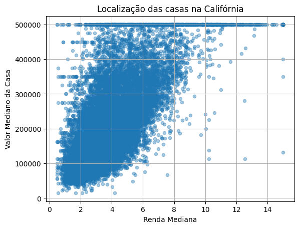
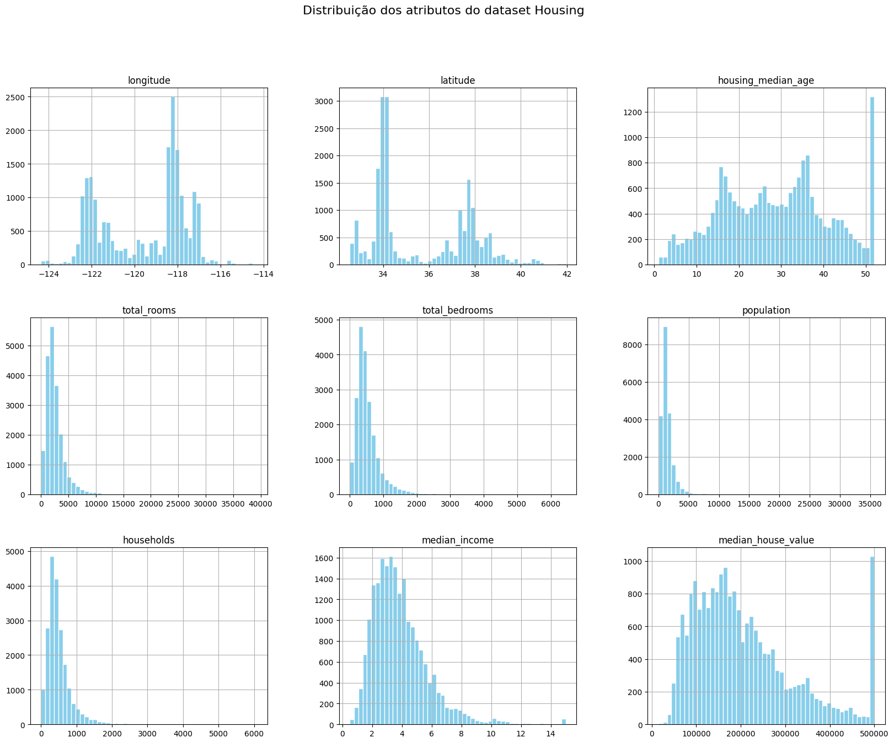
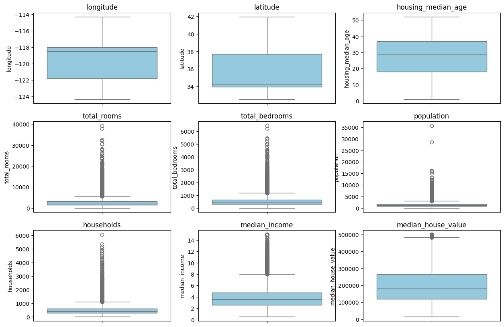
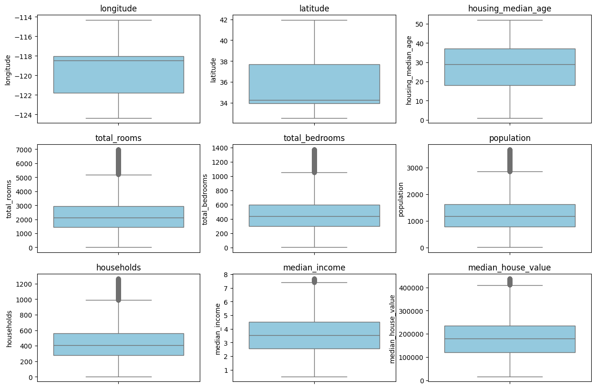

# Projeto: Previsão do Valor de Casas na Califórnia

Este projeto tem como objetivo a análise e modelagem do mercado imobiliário da Califórnia, utilizando técnicas de ciência de dados para prever o **valor mediano das casas (`median_house_value`)**. Através de análise exploratória, tratamento de dados e aplicação de modelos preditivos, buscamos compreender os fatores que influenciam os preços das casas e construir modelos precisos de previsão.

---

## 1. Descrição do Conjunto de Dados

O conjunto de dados utilizado contém informações de várias regiões da Califórnia, incluindo atributos demográficos, geográficos e de infraestrutura das residências. Algumas das principais variáveis analisadas foram:

- `median_income`: renda mediana da região.
- `housing_median_age`: idade mediana das casas.
- `total_rooms`, `total_bedrooms`: número total de cômodos e quartos.
- `population`: população da região.
- `households`: número de residências.
- `median_house_value`: valor mediano das casas (variável alvo).

O dataset contém valores faltantes, outliers e variáveis numéricas e categóricas que exigiram pré-processamento adequado.

---

## 2. Análise Exploratória de Dados (EDA)

### 2.1 Gráfico de Dispersão

Foi criado um gráfico de dispersão para explorar a relação entre `median_income` e `median_house_value`. Observa-se uma **correlação positiva clara**: regiões com maior renda mediana tendem a ter casas com valores mais altos, embora haja saturação para rendas muito elevadas.

**Observações:**  
- Existe uma tendência linear para a maioria dos dados, mas com alguns pontos extremos que indicam outliers.  
- Essa análise preliminar ajuda a identificar variáveis fortes para previsão e padrões não lineares.

---

### 2.2 Histogramas e Distribuições

Foram plotados histogramas para visualizar a distribuição das variáveis numéricas, especialmente `median_income` e `median_house_value`.

- Veja que é notória uma correlação linear positiva e que essa correlção faz sentido na medida que em regiões mais ricas tendem a ter imóveis mais caros.

**Observações:**  
- `median_income` apresenta uma distribuição levemente assimétrica à direita.  
- `median_house_value` mostra concentração de valores em faixas intermediárias, com alguns picos em valores máximos.  
- Essas informações ajudam a decidir técnicas de transformação ou normalização dos dados.

---

### 2.3 Boxplots e Outliers

Boxplots foram utilizados para identificar outliers em `total_rooms`, `total_bedrooms`, `population	households`, `median_income` e em `median_house_value`
**Antes de Tratamento de Outliers**

**Pós Tratamento de Outliers**

**Observações:**  
- Valores extremamente altos em `median_income` e `median_house_value` foram identificados.  
- Decidimos **substituir outliers por valores próximos à média ou limitar os valores máximos**, evitando que distorçam os modelos preditivos.

---

## 3. Pré-Processamento dos Dados

- Preenchimento de valores ausentes usando **mediana** das colunas.  
- Identificação e tratamento de outliers através de **Z-Score**.  
- Normalização de variáveis para modelos sensíveis a escala, como regressão linear.  
- Criação de novas features relevantes, como:
  - `rooms_per_household = total_rooms / households`
  - `bedrooms_per_room = total_bedrooms / total_rooms`
  - `population_per_household = population / households`

---

## 4. Divisão dos Dados

O dataset foi dividido em **70% para treinamento** e **30% para teste**, garantindo que os modelos fossem avaliados em dados nunca vistos.

**Justificativa:**  
- Evitar overfitting nos dados de treinamento.  
- Medir o desempenho real do modelo em dados independentes.  
- Facilitar comparação entre diferentes modelos.

---

## 5. Seleção de Variáveis e Modelagem

### 5.1 Regressão Linear

Primeiro, foi treinado um modelo de **Regressão Linear** com todas as variáveis.  
Em seguida, aplicamos **feature selection**, usando apenas `median_income`, `housing_median_age` e `rooms_per_household`.  

**Resultados:**  
-
-

---

### 5.2 Árvore de Decisão para Regressão

Foi implementada uma **Árvore de Decisão** para prever `median_house_value`.

**Comparação de Desempenho (MAE - Erro Médio Absoluto):**

| Modelo                 | MAE (Treinamento) | MAE (Teste) |
|------------------------|-----------------|-------------|
| Regressão Linear       | -----           | -----       |
| Árvore de Decisão      | -----           | -----       |

**Observações:**  
- A Árvore de Decisão capturou melhor relações não lineares, apresentando MAE mais baixo no treinamento.  
- No conjunto de teste, o desempenho foi próximo à regressão linear, mostrando que a árvore pode overfit se não for regulada (ex: profundidade máxima).

---

## 6. Conclusão

O projeto demonstrou que:

- `median_income` é a variável mais influente no valor das casas.  
- Outliers impactam significativamente modelos lineares e precisam ser tratados.  
- Modelos lineares são simples e interpretáveis, mas Árvores de Decisão podem capturar padrões não lineares mais complexos.  
- A análise exploratória e pré-processamento são essenciais para construir modelos robustos e precisos.

---

## 7. Estrutura do Projeto

